# 📘 Laboratorio 02

## Plataformas Software Móviles (PSM) 2024/2025

Esta guía laboratorio ha elaborado por Diego Martín de Andrés para la asignatura Plataformas Software Móviles (PSM) del curso académico 2024/2025. 

### Nota.

Ante cualquier error o sugerencia, por favor, contactame en mi correo: diego.martin.andres@uva.es

## 📝 Tabla de contenidos


- [📘 Laboratorio 02](#-laboratorio-02)
  - [Plataformas Software Móviles (PSM) 2024/2025](#plataformas-software-móviles-psm-20242025)
    - [Nota.](#nota)
  - [📝 Tabla de contenidos](#-tabla-de-contenidos)
- [Antes de empezar 🚀](#antes-de-empezar-)
- [🎨 Configuración de la interfaz de usuario en Android Studio](#-configuración-de-la-interfaz-de-usuario-en-android-studio)
  - [⚙️ Pasos para cambiar el tamaño de la fuente](#️-pasos-para-cambiar-el-tamaño-de-la-fuente)
- [📱 Configuración del Dispositivo Virtual Android (AVD)](#-configuración-del-dispositivo-virtual-android-avd)
  - [Introducción](#introducción)
  - [¿Por qué usar un emulador? 🤔](#por-qué-usar-un-emulador-)
  - [1. Acceso al **Device Manager** 🛠️](#1-acceso-al-device-manager-️)
  - [2. Selección del dispositivo virtual 📱](#2-selección-del-dispositivo-virtual-)
  - [3. Selección de la versión de Android 🧁](#3-selección-de-la-versión-de-android-)
  - [4. Configuración del dispositivo virtual de Android (AVD) ⚙️](#4-configuración-del-dispositivo-virtual-de-android-avd-️)
  - [5. Finalizar la configuración ✅](#5-finalizar-la-configuración-)
  - [6. Ejecutar la aplicación en el emulador ▶️](#6-ejecutar-la-aplicación-en-el-emulador-️)
  - [7. Personalización del emulador 🖥️](#7-personalización-del-emulador-️)
  - [8. Ejecutar la aplicación en el emulador ▶️](#8-ejecutar-la-aplicación-en-el-emulador-️)
- [🖼️ Vista previa de la interfaz de usuario (Preview)](#️-vista-previa-de-la-interfaz-de-usuario-preview)
  - [1. ¿Qué es la vista previa? 🔍](#1-qué-es-la-vista-previa-)
  - [2. ¿Para qué sirve? 🤔](#2-para-qué-sirve-)
  - [3. ¿Dónde está la vista previa? 📑](#3-dónde-está-la-vista-previa-)
  - [4. Uso de funciones en el código 🛠️](#4-uso-de-funciones-en-el-código-️)
  - [5. Cambiar el texto en la vista previa ✏️](#5-cambiar-el-texto-en-la-vista-previa-️)
  - [6. ¿Por qué es útil la vista previa? 🚀](#6-por-qué-es-útil-la-vista-previa-)
  - [7. Explicación de lo que está pasando en el código 📝](#7-explicación-de-lo-que-está-pasando-en-el-código-)
    - [1. **Ejecución en el AVD (Android Virtual Device) 🖥️:**](#1-ejecución-en-el-avd-android-virtual-device-️)
    - [2. **Ejecución en el Preview 👁️:**](#2-ejecución-en-el-preview-️)
    - [❓ ¿Por qué se muestra diferente en AVD y Preview?](#-por-qué-se-muestra-diferente-en-avd-y-preview)
    - [🔄 ¿Cómo ayuda esto a reutilizar código?](#-cómo-ayuda-esto-a-reutilizar-código)
- [🔍 Importaciones y bibliotecas 📚](#-importaciones-y-bibliotecas-)
  - [1. Introducción al código 📜](#1-introducción-al-código-)
  - [2. Importar código 📦](#2-importar-código-)
  - [3. ¿Qué es una biblioteca? 📚](#3-qué-es-una-biblioteca-)
  - [4. Temas de la aplicación 🎨](#4-temas-de-la-aplicación-)
- [📋 Visión general de **MainActivity.kt**](#-visión-general-de-mainactivitykt)
  - [Introducción 👋](#introducción-)
  - [1. Definición de la clase 📝](#1-definición-de-la-clase-)
    - [¿Qué es una clase? 🏫](#qué-es-una-clase-)
  - [2. Actividades en Android 📱](#2-actividades-en-android-)
  - [3. ¿Qué es una actividad? 🎬](#3-qué-es-una-actividad-)
  - [4. Método `onCreate()` 🛠️](#4-método-oncreate-️)
    - [¿Qué hace `onCreate()`?](#qué-hace-oncreate)
  - [5. Función Greeting 🖋️](#5-función-greeting-️)
    - [¿Qué es un Composable?](#qué-es-un-composable)


---

# Antes de empezar 🚀

Es necesario que tengas creado un proyecto en **Android Studio**. Debe ser una **empty activity** y el espacio de nombres debe empezar por `es.uva.sg.psm.` seguido de un nombre que identifique tu aplicación. Por ejemplo, si estás en el **laboratorio 1**, podrías llamarlo `lab01`.

---

# 🎨 Configuración de la interfaz de usuario en Android Studio

## ⚙️ Pasos para cambiar el tamaño de la fuente

1. **Accede al menú**: Haz clic en el ícono de "hamburguesa" en la esquina superior izquierda de Android Studio.
<div style="text-align: center;"> 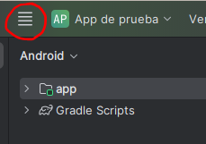 </div>


1. **Selecciona la opción de vista**: Ve a `View > Appearance > Zoom IDE` 
2. **Ajusta el zoom**: Actualmente, está al 100%. En mi caso, lo he ajustado a un 150%.

<div style="display: flex; justify-content: center; width: 100%;">
    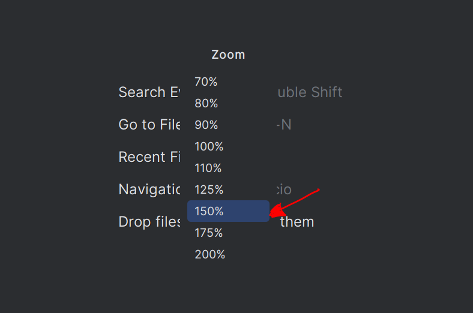
</div>

4. **Prueba diferentes tamaños**: Si sientes que el zoom es demasiado, puedes ajustarlo a 150% para tener un equilibrio entre el tamaño del código y la interfaz sin que te abrume.

---

# 📱 Configuración del Dispositivo Virtual Android (AVD)

## Introducción 
En este apartado, configuraremos nuestro dispositivo virtual Android (AVD), que es básicamente un **emulador de Android** para tu PC. Esto facilitará la depuración y prueba de tus aplicaciones sin necesidad de conectar tu teléfono constantemente. Posteriormente, también veremos cómo configurar el dispositivo físico.

## ¿Por qué usar un emulador? 🤔
- 📱 **Depuración más fácil**: Probar tu código directamente en el emulador agiliza el proceso.
- 🔄 **Evitar conexiones frecuentes**: Con el AVD, no necesitas conectar tu teléfono todo el tiempo.
- 📱 **Pruebas en múltiples dispositivos**: Puedes simular distintos tamaños de pantalla y versiones de Android sin tener múltiples teléfonos.

---

## 1. Acceso al **Device Manager** 🛠️
Para comenzar, debemos abrir el **Device Manager**:

1. 🔍 En la barra lateral derecha de Android Studio, selecciona **Device Manager**.

<div style="text-align: center;"> 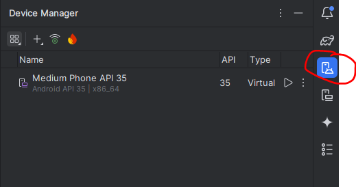 </div>

1. 🗂️ Alternativamente, en la hamburguesa vamos al menú **Tools** , selecciona **Device Manager**.
2. Si pulsas el botón con el ➕, y después a **Create virtual device** se abrirá una ventana donde podrás configurar tu dispositivo virtual Android como en la siguiente imagen:

<div style="text-align: center;"> 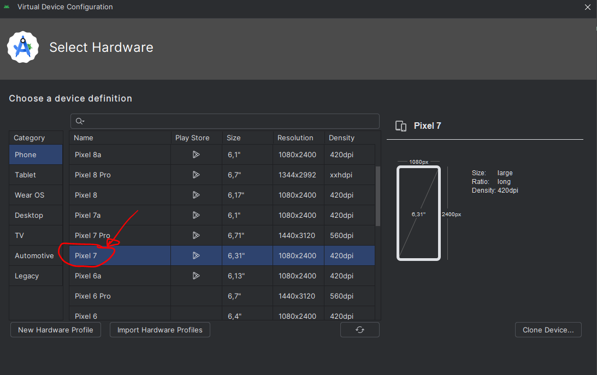 </div>

---

## 2. Selección del dispositivo virtual 📱

- El dispositivo que vamos a utilizar por defecto será el **Pixel 7**. Es un teléfono lo suficientemente grande y actualizado.
- Puedes ver otras opciones como Pixel 6, Pixel 7 Pro, entre otros.
- También puedes emular tablets, relojes con Wear OS, dispositivos de TV, y más.
- Le damos a **Next** para continuar.

---

## 3. Selección de la versión de Android 🧁

- Selecciona la versión de Android que deseas emular. Para la prueba que vamos a hacer, usaremos **Upside Down Cake (API nivel 34)**, aunque nos valdría cualquier versión superior que tengas instalada como la **API 35**.
- Es muy probable que no tengas esta versión instalada, para ello deberás descargarla pulsando en el botón que aparece en la imagen de abajo
  
<div style="text-align: center;"> 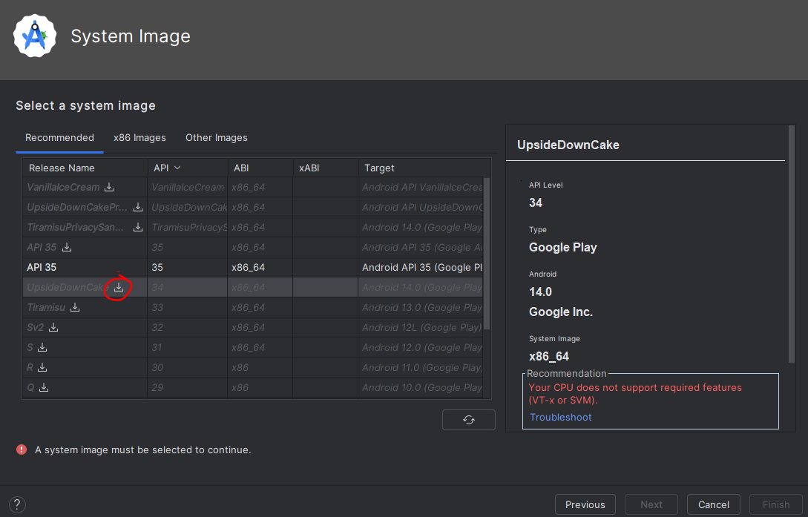 </div>

- Esto abrirá una ventana donde se instalará la imagen **Upside Down Cake (API nivel 34)** como vemos en la imagen de abajo:

<div style="text-align: center;"> 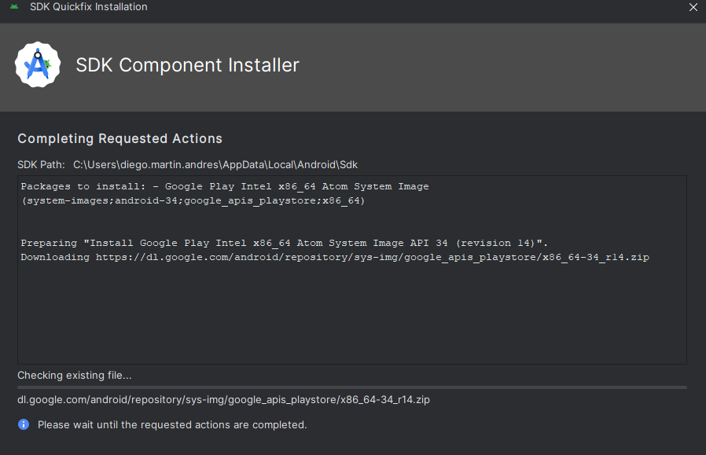 </div>


---

## 4. Configuración del dispositivo virtual de Android (AVD) ⚙️

Al configurar el dispositivo virtual, puedes personalizar los siguientes aspectos:

- **Nombre del dispositivo**: Te pondrá el nombre "Pixel 7 API 34" por defecto, pero puedos cambiarlo.
- 📏 **Tamaño de pantalla**: El Pixel 7 tiene una pantalla de 6.31 pulgadas y una resolución de 1080 x 2400 píxeles.
- 🖥️ **DPI**: El dispositivo tiene una densidad de píxeles de 420 DPI.
- 🌐 **Orientación**: Puedes elegir una orientación por defecto al arrancar **vertical** o **horizontal** (por defecto deja vertical).
- 🛠️ **Preferred ABI**: Debes dejarlo en "Optimal". ABI significa **Application Binary Interface** habla del conjunto de instrucciones que queremos usar de la CPU
- Podemos ir a opciones avanzadas pulsando en **Show advance options** y cambiar algunas preferencias como:
  - 📸 **Emulación de cámara**: Puedes usar la cámara de tu PC o una escena virtual para pruebas.
  - 🚀 **Boot option**: Recomendamos seleccionar **Quick Boot** para iniciar más rápido.

---

## 5. Finalizar la configuración ✅

1. Una vez completados los ajustes, haz clic en **Finish**.
2. Tu dispositivo virtual aparecerá en el **Device Manager** como **Pixel 7 API 34**.
3. Ahora puedes ejecutar aplicaciones directamente en este emulador pulsando el botón de **Run** o la combinación de teclas `Shift + F10`.

---

## 6. Ejecutar la aplicación en el emulador ▶️

1. Selecciona tu dispositivo virtual y haz clic en **Run App** (o presiona `Shift + F10`).
2. El **Gradle** comenzará a compilar tu aplicación y, tras un momento, el emulador se iniciará.
3. Suponiendo que hemos creado una **Empty activity** (si no lo has hecho puedes hacer un proyecto nuevo de prueba para que veas como se ejecuta), la aplicación se ejecutará automáticamente en el dispositivo virtual. En este caso, veremos un mensaje que dice **Hello Android**.
4. Podemos buscar el funcionamiento de esta aplicación si vamos al navegador del proyecto en el panel izquierdo y buscamos la carpeta **app > kotlin+java > es.uva.sg.psm.myfirstapp > MainActivity.kt**. Ahí veremos el código que genera el mensaje:

```kotlin
@Composable
fun Greeting(name: String, modifier: Modifier = Modifier) {
    Text(
        text = "Hello $name!",
        modifier = modifier
    )
}
```

5. También puedes cambiar el código para que muestre tu nombre en lugar de **Hello Android**. Para ello, tienes que buscar el código de abajo y sustituir **Android** por tu nombre:

```kotlin
class MainActivity : ComponentActivity() {
    override fun onCreate(savedInstanceState: Bundle?) {
        super.onCreate(savedInstanceState)
        enableEdgeToEdge()
        setContent {
            MyFirstAppTheme {
                Scaffold(modifier = Modifier.fillMaxSize()) { innerPadding ->
                    Greeting(
                        name = "Andorid",
                        modifier = Modifier.padding(innerPadding)
                    )
                }
            }
        }
    }
}
```
⌛ **Nota**: Usa `Ctrl + F` (o `Cmd + F` en Mac) para buscar el término **Android**.

Si te fijas, puedes encontrar otro pedazo de código donde se define el nombre **Android**. **NO LO CAMBIES DE MOMENTO!!**, tiene una explicación que veremos más adelante. 

El código **QUE DE MOMENTO NO DEBES TOCAR** es:

```kotlin
@Composable
fun GreetingPreview() {
    MyFirstAppTheme {
        Greeting("Android")
    }
}
```
6. También puedes buscar por el texto **Hello** y un símbolo de dólar seguido de **name** (`$name`). Vamos a cambiar **Hello** por **Welcome**.

---

## 7. Personalización del emulador 🖥️

- Puedes mantener el emulador en una ventana separada o integrarlo en la interfaz de Android Studio. Pulsando en el botón de la imagen de abajo, puedes sacar el AVD en otra ventana. Esto es muy útil si trabajas como yo con varios monitores.


<div style="text-align: center;"> 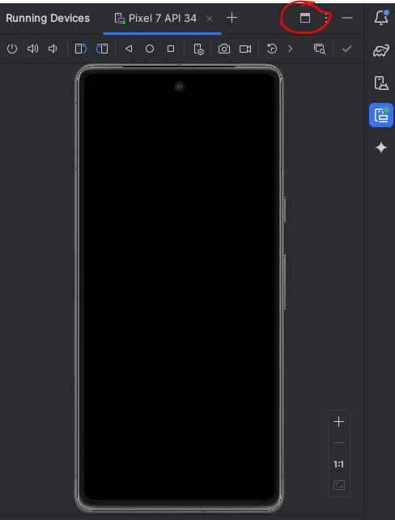 </div>

- Para volverlo a integrar, pulsa en el botón de la imagen de abajo:

<div style="text-align: center;"> 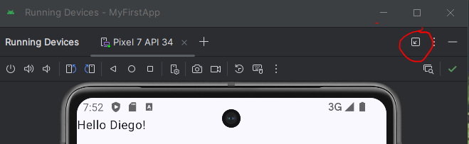 </div>


- Ajusta el tamaño de la ventana o utiliza el zoom para observar mejor el contenido.
- Navega por el emulador como lo harías en un teléfono real. Puedes acceder al **Play Store** e instalar aplicaciones si inicias sesión.

---

## 8. Ejecutar la aplicación en el emulador ▶️

Para ejecutar nuestra aplicación tal y como está en este momento:

1. Haz clic en el botón **Run**.
2. Asegúrate de que el emulador esté encendido. Si no lo está, enciéndelo.
3. La aplicación se construirá y se instalará en el dispositivo.
4. Una vez arrancado tu AVD (Android Virtual Device), no será necesario que lo apagues y lo vuelvas a arrancar cada vez que hagas un cambio en tu aplicación. Solo tendrás que pulsar el botón **Run** o **Re-Run** para que se actualice la aplicación en el emulador.


<div style="display: flex; justify-content: space-between; width: 100%;">
    <figure style="width: 45%; text-align: center;">
        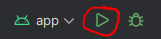
        <figcaption>Botón Run</figcaption>
    </figure>
    <figure style="width: 45%; text-align: center;">
        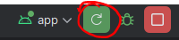
        <figcaption>Botón Re-Run</figcaption>
    </figure>
</div>


⌛ **Nota**: Esto puede tardar unos segundos o minutos, dependiendo de tu PC.

---

# 🖼️ Vista previa de la interfaz de usuario (Preview)


Vamos a hablar sobre la **vista previa** o **preview**. 


## 1. ¿Qué es la vista previa? 🔍

La vista previa permite mostrar la interfaz de usuario de nuestra aplicación directamente en **Android Studio** sin tener que ejecutarla en el emulador. Y esto nos puede ahorrar mucho tiempo.

---

## 2. ¿Para qué sirve? 🤔

Si modificas lo que debe mostrar tu aplicación, ejecutar el programa en el emulador puede tardar mucho tiempo. Para evitarlo, la vista previa te permite ver los cambios instantáneamente sin tener que instalar la aplicación cada vez. 

---

## 3. ¿Dónde está la vista previa? 📑

1. En la parte superior derecha de Android Studio, encontrarás el botón  **Split** para dividir la vista, lo que te permitirá ver la interfaz de usuario directamente. Como ves en la imagen de abajo.

<div style="text-align: center;"> 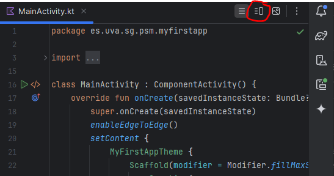 </div>

2. Por defecto, se nos abrirá el panel de **Preview** Aquí podemos ver lo que el usuario verá en la app, como el texto **Hello Android** (Si me hiciste caso y no cambiaste el código que te dije que no cambiaras).

<div style="text-align: center;"> 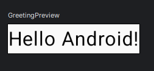 </div>


---

## 4. Uso de funciones en el código 🛠️

Lo que estamos viendo en la vista previa es el resultado de una función llamada **Greeting** que ya hemos usado antes. Las **funciones** nos permiten reutilizar código, es decir, escribirlo una vez y usarlo en diferentes partes de la aplicación. 

``` Kotlin
@Preview(showBackground = true)
@Composable
fun GreetingPreview() {
    MyFirstAppTheme {
        Greeting("Android")
    }
}
```

Fíjate que llamamos dentro de la funcion **GreetingPreview** a la función **Greeting** que recibe un parámetro de tipo **String**. 

---

## 5. Cambiar el texto en la vista previa ✏️

Vamos a modificar lo que se muestra en la vista previa:

1. En lugar de **Android**, cambiaremos el texto a tu nombre, en mi caso **Diego**.
   
``` Kotlin
@Preview(showBackground = true)
@Composable
fun GreetingPreview() {
    MyFirstAppTheme {
        Greeting("Diego")
    }
}
```

2. Notarás que el cambio ocurre **instantáneamente** en la vista previa. Ahorrándonos tiempo al no tener que ejecutar la aplicación en el emulador. 

---

## 6. ¿Por qué es útil la vista previa? 🚀

La vista previa es especialmente útil cuando tienes una interfaz de usuario compleja. Evita que tengas que ejecutar la aplicación en el emulador o en un dispositivo físico, lo cual puede tomar tiempo dependiendo del hardware y de la complejidad de la app.

---

## 7. Explicación de lo que está pasando en el código 📝

Nota: para esta explicación suponemos el siguiente código.

En la **Preview** he dejado **"Android"** mientras que en **onCreate** he dejado **"Diego"**.

``` Kotlin
@Preview(showBackground = true)
@Composable
fun GreetingPreview() {
    MyFirstAppTheme {
        Greeting("Android")
    }
}
```

``` Kotlin
class MainActivity : ComponentActivity() {
    override fun onCreate(savedInstanceState: Bundle?) {
        super.onCreate(savedInstanceState)
        enableEdgeToEdge()
        setContent {
            MyFirstAppTheme {
                Scaffold(modifier = Modifier.fillMaxSize()) { innerPadding ->
                    Greeting(
                        name = "Diego",
                        modifier = Modifier.padding(innerPadding)
                    )
                }
            }
        }
    }
}
```


### 1. **Ejecución en el AVD (Android Virtual Device) 🖥️:**
Cuando ejecutas la aplicación en el AVD, la actividad principal es la clase `MainActivity`. En el método `onCreate`, se invoca a `setContent`, que es donde se establece la UI principal de la aplicación. Dentro de este bloque, llamas a la función `Greeting` pasando el parámetro `name` con el valor `"Diego"`. Por lo tanto, el texto que se renderiza en la aplicación es `"Hello Diego!"`.

### 2. **Ejecución en el Preview 👁️:**
Cuando estás viendo la vista previa de tu composable en el editor de Android Studio, la anotación `@Preview` se utiliza para indicar a Android Studio que debe mostrar una representación gráfica de la UI. En la función `GreetingPreview`, llamas a la función `Greeting` con el parámetro `"Android"`. Por eso, cuando ves la vista previa en el editor, el texto que se muestra es `"Hello Android!"`.

### ❓ ¿Por qué se muestra diferente en AVD y Preview?
- **En AVD:** Se ejecuta la clase `MainActivity` real, que es el código que va en la aplicación cuando se despliega en un dispositivo. En este caso, se llama a `Greeting` con el nombre `"Diego"`, que es lo que tú especificaste en tu código.
  
- **En Preview:** Se ejecuta el composable marcado con `@Preview`. Este es un entorno especial de Android Studio que te permite ver cómo se vería tu UI sin necesidad de ejecutarla en un dispositivo o emulador. Para este caso, la función `GreetingPreview` llama a `Greeting("Android")`, lo que explica por qué el texto en la vista previa es `"Hello Android!"`.

### 🔄 ¿Cómo ayuda esto a reutilizar código?
Al crear una función composable como `Greeting`, puedes reutilizarla en múltiples lugares de tu código con diferentes parámetros. Aquí la estás utilizando:
1. En el `MainActivity`, pasando `"Diego"`.
2. En la función de vista previa `GreetingPreview`, pasando `"Android"`.

Así, la lógica de cómo se muestra el texto es la misma, pero puedes cambiar el contenido dinámicamente según el contexto.

En resumen, el mecanismo de `@Preview` permite que Android Studio renderice una versión de tu UI sin necesidad de ejecutar la aplicación completa, mientras que en el AVD, se ejecuta el código de tu actividad principal.

# 🔍 Importaciones y bibliotecas 📚

Vamos a ver una visión general de nuestro archivo **MainActivity.kt** especialmente en la parte de importaciones y bibliotecas.

---

## 1. Introducción al código 📜

Primero, veamos cómo está estructurado el archivo:

Lo primero que nos encontramos es algo como:

``` Kotlin
package es.uva.sg.psm.myfirstapp
```

Este es el nombre del **package** que le dimos a nuestra aplicación cuando la creamos. 

Por ejemplo, en este caso se llamó `package es.uva.sg.psm.myfirstapp` 

El nombre por defecto suele ser algo como `com.example.nombredeapp`. Para este curso, usaremos el prefijo `es.uva.sg.psm.` Indicando que la aplicación está localizada en **España**, en la **Universidad de Valladolid** en el campus de **Segovia** y en la asignatura **PSM**. A la derecha de esto pondremos el nombre de la APP que estémos desarrollando. Normalmente usaremos **lab01** para indicar que estamos haciendo pruebas el día del **laboratorio 1** 

---

## 2. Importar código 📦

Después, encontramos las líneas de **import** de código, pero algunas pueden estar ocultas. En la imagen de abajo se muestra la pequeña flecha para desplegar todos los **imports**

<div style="text-align: center;"> 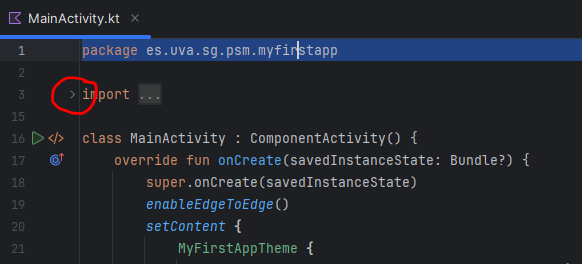 </div>

Si pulsamos la flecha, veremos algo como:

``` Kotlin
import android.os.Bundle
import androidx.activity.ComponentActivity
import ...
```

Las importaciones son básicamente bibliotecas que permiten a nuestra aplicación acceder a funcionalidades preexistentes. Estas bibliotecas contienen código que nos facilita el desarrollo sin tener que escribir todo desde cero.

---

## 3. ¿Qué es una biblioteca? 📚

Podemos imaginar una **biblioteca** como una colección de libros. Cada uno de estos libros tiene instrucciones que nuestra aplicación puede seguir. 

Si importamos una biblioteca, como por ejemplo `androidx.activity.ComponentActivity`, lo que estamos haciendo es traernos todo el código de dicha clase a nuestro ámbito, en este caso a la clase `MainActivity`, para ser utilizado.

Por ejemplo:

- **ComponentActivity** define cómo debe comportarse nuestra actividad principal.
- Las bibliotecas de `androidx.compose.` se tratan del **Jetpack Compose** nos permiten construir la interfaz de usuario de manera moderna y eficiente.

Jetpack Compose es la forma más reciente de construir interfaces de usuario en Android, reemplazando el antiguo método basado en [**XML**](https://en.wikipedia.org/wiki/XML), a estas alturas del Grado deberías saber lo que es [**XML**](https://en.wikipedia.org/wiki/XML), aquí te dejo un enlace por si necesitas repasarlo. Aunque Compose es la opción más reciente, aún es posible que necesites XML cuando trabajes en aplicaciones antiguas.

---

## 4. Temas de la aplicación 🎨

Al final de las importaciones, podemos ver algo como:

``` Kotlin
import es.uva.sg.psm.myfirstapp.ui.theme.MyFirstAppTheme
```

Si te fijas ese ya es el espacio de nombres que hemos definido para nuestra aplicación. Esto está relacionado con el tema visual de la aplicación. El **tema** define cosas como los colores y las fuentes que se utilizarán en toda la interfaz. El la función `MyFirstAppTheme` se encuentra dentro de `app > kotlin+java > es.uva.sg.psm.myfirstapp > ui.theme > Theme.kt` y dentro del código podrás encontrar la función  `fun MyFirstAppTheme( ...` tal y como te mostramos en la imagen de abajo.

<div style="text-align: center;"> 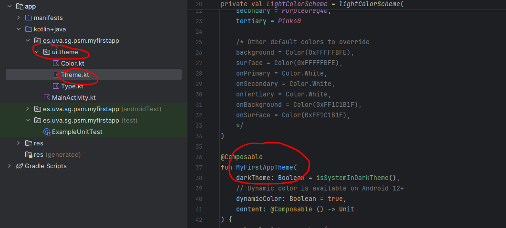 </div>

---

# 📋 Visión general de **MainActivity.kt**

## Introducción 👋
Ahora que entiendes cómo funcionan las importaciones y los paquetes, vamos a profundizar más en eso más adelante. Ahora vamos a ver qué está pasando después de las importaciones.

---

## 1. Definición de la clase 📝

Después de las importaciones, encontramos nuestra **clase**. Vamos a reducir las importaciones para hacer el código más compacto:

1. Haz clic en la flecha junto a las importaciones para plegarlas.
2. Así nuestro código se verá más pequeño, aunque las importaciones siguen ahí. 

Luego, tenemos nuestra clase definida como:

``` Kotlin
class MainActivity : ComponentActivity() {
    // Código de la clase
}
```

📝 **Nota:** También podemos usar la pequeña flecha del margen izquierdo para expandir y contraer las clases.

### ¿Qué es una clase? 🏫
**Kotlin** sigue el paradigma de [Programación Orientada a Objetos](https://es.wikipedia.org/wiki/Programaci%C3%B3n_orientada_a_objetos), para este curso entendemos que tienes conocimientos suficientes en POO como para seguir el curso, en cualquier caso aquí tienes el link sobre la [POO](https://es.wikipedia.org/wiki/Programaci%C3%B3n_orientada_a_objetos). 

Explicado de una manera muy burda, una **clase** es un conjunto de código en programación que agrupa lógica, y funcionalidades; que posteriormente se implementará en objetos concrectos.

En este caso, `MainActivity` es la clase que define el punto de inicio de nuestra aplicación.

En **Kotlin** (al igual que en **JAVA**) se utiliza los corchetes cursivos de apertura `{` y cierre  `}` para definir un bloque. Y un bloque puede ser el cuerpo de una clase, o lo que nos encontramos dentro de un `if`, `for`, `while`, etc.

---

## 2. Actividades en Android 📱

El **MainActivity** es el punto de partida de nuestra aplicación, y es donde la ejecución comienza. La definición:

``` Kotlin
class MainActivity : ComponentActivity() {
    // Código de la clase
}
```

Mas adelante explicaremos por qué nuestro código comienza por aquí.

Después de los dos puntos `:`, vemos `ComponentActivity()`. Eso significa que `MainActivity` hereda de la clase `ComponentActivity`, que es una clase de Android que gestiona el ciclo de vida de la actividad. Si haces clic en `ComponentActivity` como ves en la imagen de abajo, podrás ver más información en **Android Studio**.

Si quisieras más información puedes buscar en internet sobre la clase [`ComponentActivity`](https://www.google.com/search?q=androidx.activity.ComponentActivity) y seguramente ne las primeras entradas encontrarás la [documentación oficial de Android](https://developer.android.com/reference/androidx/activity/ComponentActivity)


También puedes navegar al código fuente de la clase `ComponentActivity` pulsando `control` y haciendo clic en el nombre de la clase. Aunque de momento, y en este curso, no es necesario que entendamos el código que hay detrás de las clases predefinidas, con usarlas en el 99% de los casos es suficiente.

<div style="text-align: center;"> 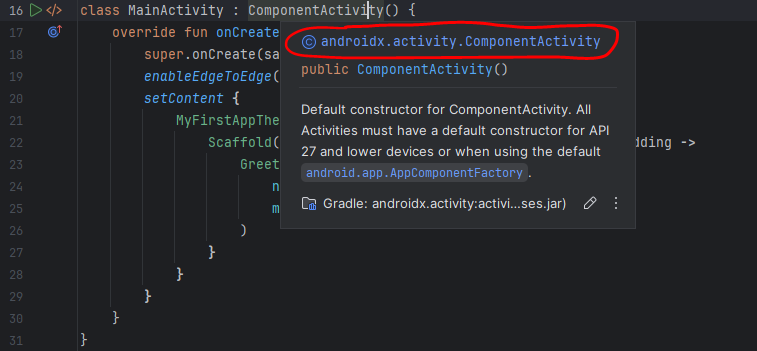 </div>

Por lo tanto, nuestra clase `MainActivity` hereda todas las propiedades y métodos de `ComponentActivity`.

---

## 3. ¿Qué es una actividad? 🎬

Una **actividad** es básicamente lo que ves en pantalla, es decir, una **pantalla completa** en tu aplicación. Al navegar de una pantalla a otra, saltas entre **actividades**. Por ahora, solo tenemos **MainActivity**, pero más adelante veremos cómo agregar más.

---

## 4. Método `onCreate()` 🛠️

Dentro de **MainActivity**, encontramos el siguiente método:

``` Kotlin
 override fun onCreate(savedInstanceState: Bundle?) {
        super.onCreate(savedInstanceState)
        enableEdgeToEdge()
        setContent {
            MyFirstAppTheme {
                Scaffold(modifier = Modifier.fillMaxSize()) { innerPadding ->
                    Greeting(
                        name = "Diego",
                        modifier = Modifier.padding(innerPadding)
                    )
                }
            }
        }
    }
```

### ¿Qué hace `onCreate()`?
- Primero de todo, fíjate que tiene el modificador `override`. Eso significa que estamos sobreescribiendo un método de la clase padre, en este caso, de `ComponentActivity`.	
- **`onCreate()`** se ejecuta cuando la actividad se crea por primera vez.
- Lo siguiente que ejecuta, es una llamada al constructor de la clase madre **`super.onCreate()`** agregando el comportamiento por defecto de la actividad antes de que agreguemos nuestra propia lógica.
- Para terminar, añade el propio comportamiento con **`setContent`**. Aquí es donde se establece el contenido de la pantalla.


---
## 5. Función Greeting 🖋️

Finalmente, mostramos el saludo utilizando la función **Greeting**:

``` Kotlin
                    Greeting(
                        name = "Diego",
                        modifier = Modifier.padding(innerPadding)
                    )
```

Fíjate, que todo lo que está marcado con un color verde como `MyFirstAppTheme`, `Scaffold`, `Modifier`, `padding`, `fillMaxSize`, etc., son funciones **Composable**. Como vemos en la imagen de abajo.

<div style="text-align: center;"> 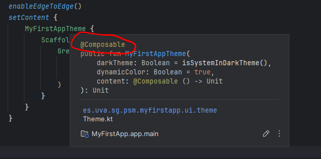 </div>


### ¿Qué es un Composable?
Un `Composable` es un bloque de código que describe una interfaz de usuario y que se puede ver en la pantalla. Los elementos `Composable` tienen una estructura en árbol recursiva. Es decir, que un `Composable` está compuesto por uno o más `Composable` o ya es el elemento final visualizable. Es una forma muy común de organizar elementos.

Como podemos ver en la foto de abajo, en `fun onCreate` se llama a la función `fun Greeting` con el parámetro `name` con el valor `"Diego"` y además el `Modifier` que ya veremos lo que significa.

<div style="text-align: center;"> 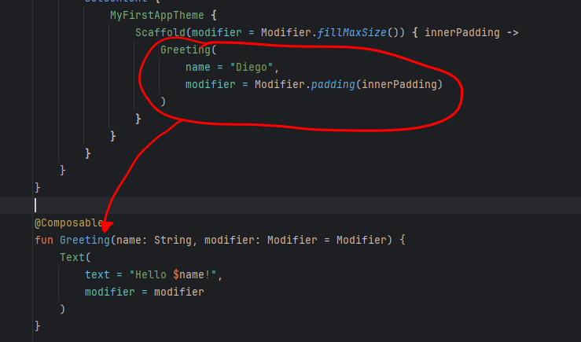 </div>


---


