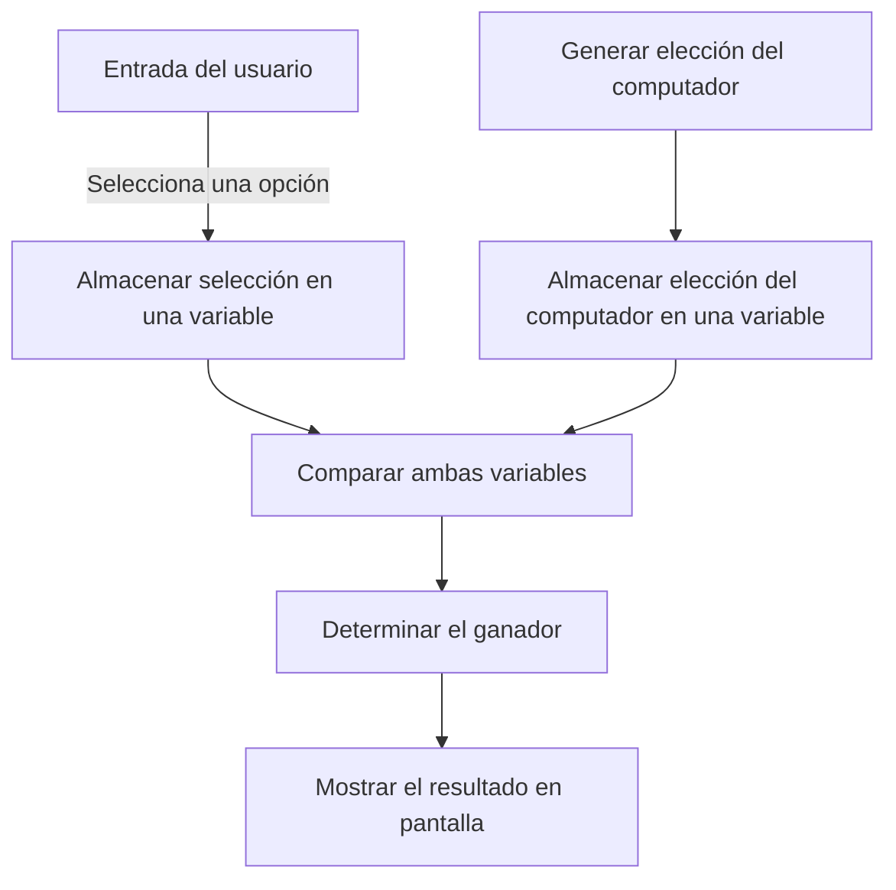

# 📘 Laboratorio 02: Piedra, papel y tijeras 🚽✂️📄

## Plataformas Software Móviles (PSM)

Estas guías de laboratorio han sido elaboradas por:

 **Diego Martín de Andrés** 
 
 Para la asignatura **Plataformas Software Móviles (PSM)** 
 
 En el curso académico 2024/2025. 🎓

---

### 📌 Nota

Ante cualquier error o sugerencia, por favor, contáctame en mi correo: [diego.martin.andres@uva.es](mailto:diego.martin.andres@uva.es) 📧.

## 📝 Tabla de contenidos

- [📘 Laboratorio 02: Piedra, papel y tijeras 🚽✂️📄](#-laboratorio-02-piedra-papel-y-tijeras-️)
- [Introducción al juego "Piedra, Papel o Tijeras" 🚽✂️📄](#introducción-al-juego-piedra-papel-o-tijeras-️)
- [Entrada de Datos del Usuario y Condicionales en Kotlin 🎮](#entrada-de-datos-del-usuario-y-condicionales-en-kotlin-)
- [Aplicación de Piedra, Papel o Tijeras en Kotlin 🕹️](#aplicación-de-piedra-papel-o-tijeras-en-kotlin-️)
- [¿Pero qué es `?:`?](#pero-qué-es-)
- [Continuando con la aplicación de Piedra, Papel o Tijeras 🚽 📄 ✂️](#continuando-con-la-aplicación-de-piedra-papel-o-tijeras---️)
- [Finalizando la aplicación de Piedra, Papel o Tijeras 🚽✂️📄](#finalizando-la-aplicación-de-piedra-papel-o-tijeras-️)
- [Sentencias While en Kotlin 🔄](#sentencias-while-en-kotlin-)

---

# Introducción al juego "Piedra, Papel o Tijeras" 🚽✂️📄
(Es cierto, no es una piedra, pero es un inodoro y estos pero suelen ser Roca que es lo más parecido a una piedra 😂)

## Introducción
Vamos a programar el juego **Piedra, Papel o Tijeras** en Kotlin. Antes de adentrarnos en los detalles de cómo progamar la aplicación, vamos a reflexionar en términos generales sobre lo que necesitamos.

---

## 1. ¿Qué necesitamos para construir el juego? 🤔

Para crear este juego, necesitamos entender lo siguiente:

- **Nuestra elección**: Saber qué opción eligió el usuario (piedra, papel o tijeras).
- **Elección del computador**: Saber qué opción eligió el algoritmo.
- **Comparación**: Con los dos datos anteriores, ya podemos comparar ambas elecciones para determinar el ganador.

---

## 2. Flujo de información 🧠

Por lo tanto el flujo de información es sencillo:

- **Entrada del usuario**: Necesitamos almacenar en una variable lo que el jugador ha seleccionado.
- **Elección del computador**: Necesitamos generar la elección del computador y almacenarlo en una variable.
- **Comparación de elecciones**: Comparando ambas variables se puede determinar el ganador y mostrarlo en pantalla.



---

## 3. Tipos de datos que usaremos 📝

Veremos tres tipos de datos clave:

- **Número (`Int`)**: Para almacenar valores numéricos.
- **Texto (`String`)**: Para almacenar cadenas de texto.
- **Booleano (`Boolean`)**: Para almacenar verdadero o falso, útil para trabajar con condiciones.

---

## 5. Condiciones lógicas 🧩

El juego depende de condiciones. Por ejemplo:

- Si elegimos tijeras (opción 1) y la computadora elige piedra (opción 2), entonces piedra gana.
- Usaremos condiciones para comparar las elecciones y decidir el resultado.

---

# Entrada de Datos del Usuario y Condicionales en Kotlin 🎮

## Entrada de datos con `readLine()` 🖥️

Para solicitar la entrada de datos al usuario, utilizamos `readLine()`. Este método obtiene la entrada como una cadena (String). Si necesitamos convertirlo a otro tipo, por ejemplo, un entero (Int), usamos `.toInt()`:

``` Kotlin
println("Introduce tu edad:")
val edad = readLine().toInt()
```

También se puede realizar por partes si lo entiendes mejor. Piensa que aunque nos introduzcan "24" en realidad es un String y hay que convertirlo a un número para poder trabajar con el con una sentencia `if..else`.
    
``` Kotlin
println("Introduce tu edad:")
val entrada = readLine()
// Entrada es un String, en la siguiente instrucción lo convertimos a Int
val edad = entrada.toInt()
```

## Comparar la entrada con condicionales

Podemos aplicar condicionales **if-else** para actuar según la entrada del usuario:

``` Kotlin
if (edad >= 18) {
    println("Puedes entrar al club")
} else {
    println("Eres demasiado joven")
}
```

## Tratamiento de Errores 🛑
Si el usuario introduce un valor no numérico, se producirá una **java.lang.NumberFormatException**. ¡Hay que tener cuidado con los tipos!

Obviamente esto se puede capturar con un bloque `try-catch` como se hace en Java. Aunque es algo que veremos más adelante.

``` Kotlin
fun main() {
    try {
        val input = readLine()
        val edad = input?.toIntOrNull()

        if (edad != null) {
            println("Tu edad es $edad")
        } else {
            println("Por favor, introduce un número válido")
        }
    } catch (e: NumberFormatException) {
        println("Por favor, introduce un número")
    }
}
```

Ya explicaremos con más detalle el bloque `try-catch` y el operador seguro `?`.

# Aplicación de Piedra, Papel o Tijeras en Kotlin 🕹️

Vamos a desarrollar un sencillo juego de **Piedra, Papel o Tijeras**. Sigamos paso a paso.

## Paso 1: Crear un nuevo proyecto 🚀
1. Crea un nuevo proyecto en Android Studio llamado `RockPaperScissors`.
2. El paquete vamos a llamarlo `es.uva.sg.psm.rockpaperscissors`.
3. API 24
4. Añade un nuevo archivo **Kotlin/Class file** en `app > kotlin+java > es.uva.sg.psm.rockpaperscissors` y nómbralo `RockPaperScissors`.
5. Crea una función `main` para ejecutar el código.


## Paso 2: Inicializar las variables 🌱

Define las variables iniciales para las elecciones del jugador y la computadora.

``` Kotlin
var computerChoice: String = ""
var playerChoice: String = ""
```

## Paso 3: Obtener elección del jugador 🎮

Solicita al jugador que ingrese su elección (piedra, papel o tijeras).

``` Kotlin
println("Piedra, Papel o Tijeras: Ingrese su elección")
playerChoice = readln() ?: ""
```

# ¿Pero qué es `?:`?

Es el operador **Elvis**. Si, si, como el rey del rock. 🕺


El operador **Elvis** (`?:`) en Kotlin es un operador que se utiliza para proporcionar un **valor predeterminado** en caso de que la expresión a su izquierda sea `null`. Este operador es muy útil cuando trabajas con variables o expresiones que pueden contener valores nulos, ya que permite asignar un valor alternativo cuando se encuentra un valor `null`, evitando así excepciones de tipo `NullPointerException`.

## Sintaxis

``` Kotlin
val resultado = expresion ?: valorPredeterminado
```

- **expresion**: Puede ser cualquier valor o expresión que potencialmente podría ser `null`.
- **valorPredeterminado**: El valor que se utilizará si la **expresion** es `null`.

### Funcionamiento

- Si la **expresion** no es `null`, su valor se asigna a la variable.
- Si la **expresion** es `null`, el **valorPredeterminado** se asigna a la variable.

## Ejemplos

### Ejemplo básico

``` Kotlin
val nombre: String? = null
val nombreDefinitivo = nombre ?: "Desconocido"
println(nombreDefinitivo) // Imprime "Desconocido"
```

En este ejemplo, como `nombre` es `null`, el operador Elvis asigna `"Desconocido"` a `nombreDefinitivo`.

### Ejemplo con `readLine()`

El operador Elvis es útil para manejar entradas que podrían ser `null`:

``` Kotlin
val userInput = readLine() ?: "Entrada vacía"
println(userInput) // Si el usuario no introduce nada, imprime "Entrada vacía"
```

Aquí, si el usuario no introduce ningún valor (y `readLine()` devuelve `null`), el programa asigna `"Entrada vacía"` en su lugar.

## Comparación con otras soluciones

Sin el operador Elvis, necesitarías escribir un bloque `if` para realizar la misma operación:

``` Kotlin
val nombre: String? = null
val nombreDefinitivo = if (nombre != null) nombre else "Desconocido"
```

El operador Elvis proporciona una forma más compacta y legible de hacer lo mismo.

## Uso práctico

El operador Elvis es muy útil cuando trabajas con variables que pueden ser `null`, ya que permite asignar un valor predeterminado rápidamente. Esto es particularmente útil en las siguientes situaciones:

- Al manejar la entrada del usuario.
- Cuando trabajas con valores opcionales en bases de datos o respuestas de API.
- En cualquier caso donde una variable puede ser `null` y quieras asegurarte de que nunca será asignada como tal.

## Resumen

El operador Elvis (`?:`) en Kotlin es una forma simple y elegante de manejar valores nulos. Te permite proporcionar valores predeterminados para evitar errores comunes como las excepciones `NullPointerException`, haciendo que tu código sea más seguro y legible.


## Paso 4: Elección aleatoria de la computadora 🎲

Generamos una elección aleatoria para la computadora usando números aleatorios.

``` Kotlin
val randomNumber = (1..3).random()

if (randomNumber == 1) {
    computerChoice = "piedra"
} else if (randomNumber == 2) {
    computerChoice = "papel"
} else {
    computerChoice = "tijeras"
}

println("Elección de la computadora: $computerChoice")
```

### Reto:
¿Serías capaz de hacerlo con una sentencia `when`?

## Paso 5: Lógica de comparación ⚔️

Compara la elección del jugador con la de la computadora para determinar el resultado.

### Reto 
¿Serías capaz de hacer el código tu solo?

### Solución
<details>
  <summary>Haz clic para ver el código</summary>


Espero que no hayas sido un gallina 🐔
y lo hayas intentado por ti mismo. Aquí tienes la solución:


``` Kotlin
if (playerChoice == computerChoice) {
    println("Es un empate!")
} else if ((playerChoice == "piedra" && computerChoice == "tijeras") ||
           (playerChoice == "papel" && computerChoice == "piedra") ||
           (playerChoice == "tijeras" && computerChoice == "papel")) {
    println("¡Ganaste!")
} else {
    println("La computadora gana.")
}
```
</details>

---

 # Continuando con la aplicación de Piedra, Papel o Tijeras 🚽 📄 ✂️

Vamos a seguir desarrollando la aplicación de **Piedra, Papel o Tijeras**. Vamos a reemplazar el código usando sentencias `when`.

## Paso 1: Reemplazar `if` por `when` 💡

Primero, reemplazaremos las sentencias `if` por `when` para optimizar el código. Para cuando se genere la elección de la computadora.

Piénsalo un poco antes de ver la solución.


<details>
  <summary>Haz clic para ver el código</summary>


``` Kotlin
val randomNumber = (1..3).random()
val computerChoice = when (randomNumber) {
    1 -> "piedra"
    2 -> "papel"
    3 -> "tijeras"
}
```
</details>

## Paso 2: Comparar las elecciones ⚖️

Ahora vamos a comparar las elecciones de la computadora y el jugador usando `when`. 

¿Serías capaz de hacerlo por ti mismo?

<details>
  <summary>Haz clic para ver el código</summary>

``` Kotlin
val winner = when {
    playerChoice == computerChoice -> "empate"
    playerChoice == "piedra" && computerChoice == "tijeras" -> "jugador"
    playerChoice == "papel" && computerChoice == "piedra" -> "jugador"
    playerChoice == "tijeras" && computerChoice == "papel" -> "jugador"
    else -> "computador"
}
```
</details>

## Paso 3: Mostrar el resultado 🏆

Finalmente, mostramos el ganador de la partida.

``` Kotlin
println("La elección de la computadora fue: $computerChoice")
println("El ganador es: $winner")
```

## Tip:


<details>
  <summary>Pulsa para ver el tip, pero antes prueba por ti mismo resolverlo con las sentencias `when`</summary>


Puedes pedirle a **Android Studio** que reemplace automáticamente las sentencias `if` por `when`. Colócate encima del `if` y se abrirá un pequeño menú contextual. Selecciona **Replace 'if' with 'when'** y listo.

</details>

---

 
# Finalizando la aplicación de Piedra, Papel o Tijeras 🚽✂️📄


## Lógica para determinar el ganador 🏆

Vamos a utilizar una estructura `if-else` para determinar si fue un empate, ganó el jugador o la computadora.

``` Kotlin
if (winner == "empate") {
    println("Es un empate")
} else if (winner == "jugador") {
    println("El jugador ganó")
} else {
    println("La computadora ganó")
}
```

## Simplificación con plantillas de cadenas 💡

Podemos simplificar el código utilizando **plantillas de cadenas** en lugar de concatenación de cadenas.

``` Kotlin
if (winner == "empate") {
    println("Es un empate")
} else {
    println("El $winner ganó")
}
```
### Nota:
Si pusiste `computador` entonces no tendrás problema con el artículo `el`. Pero si pusiste `computadora` tendrás que cambiar el código.


 
# Sentencias While en Kotlin 🔄

En este ejercicio aprenderemos a utilizar bucles **while** en Kotlin. Un bucle while ejecuta un bloque de código repetidamente mientras una condición sea verdadera.

## Ejemplo básico de While con un contador 🧮

``` Kotlin
var count = 0

while (count < 3) {
    println("Count es $count")
    count++
}

println("El bucle ha terminado")
```

### Explicación
1. El código imprime el valor de `count` mientras sea menor que 3.
2. Cada iteración incrementa el valor de `count` en 1.
3. El bucle se detiene cuando `count` ya no es menor que 3.

## Consideraciones sobre bucles infinitos ⚠️

Nunca escribas un bucle sin una condición que pueda volverse falsa, como:

``` Kotlin
while (true) { /* Esto causará un bucle infinito */ }
```

### Retos
1. Modifica el código para que el bucle se ejecute 5 veces.
2. Modifica el código para que el bucle se ejecute infinitamente. ¿Sabrías parar la ejecución?
3. Modifica el código para que después de cada partida, te pregunte si quieres seguir jugando. Si introduces "s" seguirá jugando, si introduces "n" se detendrá.


