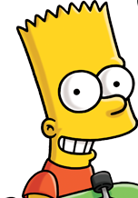
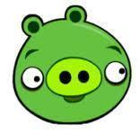
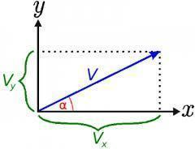

# Objetivos 🎯

1. Repasar el uso de variables y aprender a manejar referencias en Kotlin.
2. Crear funciones sencillas, tanto con la ayuda de Android Studio como a mano.
3. Repasar las clases predefinidas e introducir algunas clases nuevas.

### Nota:

Este laboratorio está basado en los de la asignatura **_Programación_** de la **Universidad Politécnica**, donde fui profesor colaborador y cuyo coordinador es Juan Carlos Dueñas. 

Los ejercicios se han adaptado a Kotlin y a la programación en Android Studio.

## Antes de la sesión de laboratorio

En cada sesión de laboratorio, para resolver las actividades que se plantean deberá seguir los siguientes pasos:

1. Leer bien el enunciado varias veces hasta comprender cuál es el problema que tiene que resolver. Este paso se llama *Análisis*. Lo puede hacer antes de la sesión.
2. Piense cómo lo va a resolver: qué clases, operaciones y datos necesita. Para ello, lo más fácil es ayudarse de papel y lápiz, sin usar el ordenador. Este paso se llama *Diseño*. Para cada clase deberá identificar: el número mínimo de atributos necesarios, el constructor con sus parámetros, los métodos que va a usar - en cada uno debe identificar primero los parámetros que necesitan y qué resultado devolverán. También se puede hacer antes de la sesión del laboratorio.
3. *Programe* el código Kotlin en Android Studio, consultando la documentación que se le proporcione, y haga los cambios necesarios hasta que compile correctamente y pueda ejecutar. Si ha hecho los pasos 1 y 2, este lo puede hacer rápidamente en el laboratorio.
4. Compruebe que la clase funciona bien (*pruebas*), para lo que puede incluir un método `main` en el que se crean objetos de la clase y se llama a sus métodos con diferentes parámetros, mostrando en la pantalla los resultados o comparándolos con los resultados esperados (que debe haber calculado a mano). También debe hacerlo en el laboratorio, o después.

Revise el siguiente enlace, contiene documentación sobre las clases predefinidas, puede ser muy útil:

[Clases predefinidas en Kotlin](https://kotlinlang.org/api/latest/jvm/stdlib/)

Busque paquete [`kotlin.math`](https://kotlinlang.org/api/latest/jvm/stdlib/kotlin.math/) y localice la descripción de sus atributos y los métodos `cos` y `sin`.

¿Qué ángulos usa? ¿Radianes o grados sexagesimales? ¿Cómo podríamos saberlo?

# Actividades 📝

1. **Creación de un proyecto llamado `retoLabo02`**

- Cree un proyecto en Android Studio llamado `retoLabo02` y añada un paquete llamado `es.uva.sg.psm.retoLabo2`.
- Cree una **empty activity**  
- Cree un fichero llamado `pruebaSeries` y una función llamada `main` que se encargue de llamar a las funciones que se describen en los retos.

## Reto 1: Comparar objetos y comparar referencias 🔍

Las referencias permiten manejar objetos. En la teoría ya habrá visto en la asignatura **"Programación orientada a objetos"** que no es lo mismo comparar referencias (son iguales si apuntan al mismo objeto) que comparar objetos (son iguales si los valores de los atributos son iguales).

El reto consiste en adivinar el resultado de unas operaciones que comparan objetos y referencias antes de ejecutar el programa.

<div align="center">
    
</div>

### Pasos

1. Cree una clase que se llame `CapituloSerie`, donde cada objeto será un episodio de una temporada de una serie. Por ejemplo, el primer capítulo de la temporada décima de **"Los Simpsons"**. Puede crearlo en el mismo fichero `pruebaSeries` o en otro fichero como hacíamos en Java.

2. Defina estos tres atributos en la clase:
   
   ```kotlin
   class CapituloSerie(
       var serie: String,
       var temporada: Int,
       var episodio: Int
   )
   ```

<div align="center">
    
</div>

3. Otro ejemplo de método que puede crear automáticamente es `toString()`, que sirve para obtener un `String` con los valores de los atributos de un objeto, que luego puede imprimir. 
   
   1. Coloca el cursor dentro de la clase, entre las llaves `{}`.
   2. Abre el menú de generación con Alt + Insert (o Cmd + N en macOS) o en el menú superior seleccionando "Code" y luego "Generate".
   3. Selecciona "toString()".
   4. Selecciona los atributos que quieres mostrar (en este caso, serie, temporada y episodio).
   5. Android Studio generará automáticamente el método `toString()` basado en los atributos seleccionados.

<div align="center">
    
</div>

4. Cree un método para comparar objetos (no referencias) generando los métodos `equals()` y `hashCode()`.

   1. Abre el menú de generación con Alt + Insert (o Cmd + N en macOS).
   2. Selecciona "equals() y hashCode()".
   3. Selecciona los atributos relevantes (serie, temporada y episodio).
   4. Android Studio generará el código para los métodos `equals()` y `hashCode()`.

### Añade la función `main()`

Antes de ejecutarlo, apunte lo que cree que va a aparecer en la pantalla cuando se llame a `println` las 18 veces.

```kotlin
fun main() {
    val p1 = CapituloSerie("Los Simpson", 1, 10)
    val p2 = CapituloSerie("Juego de Tronos", 1, 5)
    val p3 = p2

    println("p1 antes = $p1")
    println("p2 antes = $p2")
    println("p3 antes = $p3")

    println("p1 y p2 son el mismo objeto = ${p1 === p2}")
    println("p1 y p2 son objetos iguales = ${p1 == p2}")
    println("p1 y p3 son el mismo objeto = ${p1 === p3}")
    println("p1 y p3 son objetos iguales = ${p1 == p3}")
    println("p3 y p2 son el mismo objeto = ${p3 === p2}")
    println("p3 y p2 son objetos iguales = ${p3 == p2}")

    var p1Mutable = p1
    var p2Mutable: CapituloSerie? = p2
    p1Mutable = p2Mutable!!  // Aseguramos que p2Mutable no es nulo en este momento
    p2Mutable = null

    println("p1 después = $p1Mutable")
    println("p2 después = $p2Mutable")
    println("p3 después = $p3")

    println("p1 y p2 son el mismo objeto = ${p1Mutable === p2Mutable}")
    println("p1 y p2 son objetos iguales = ${p1Mutable == p2Mutable}")
    println("p1 y p3 son el mismo objeto = ${p1Mutable === p3}")
    println("p1 y p3 son objetos iguales = ${p1Mutable == p3}")
    println("p3 y p2 son el mismo objeto = ${p3 === p2Mutable}")
    println("p3 y p2 son objetos iguales = ${p3 == p2Mutable}")
}
```

4. Ejecute el programa y compare el resultado con lo que había previsto. ¿Cuántas ha acertado?

<div align="center">
    
</div>

## Reto 2: Hacer cálculos aritméticos - Angry Birds 🐦

<div align="center">
    
</div>

El reto consiste en saber cuánto tiempo durará el vuelo de un Angry Bird, la altura máxima que alcanzará y a qué distancia impactará contra un cerdito, si lo lanzamos con una determinada velocidad inicial y ángulo.

Es un claro caso de trayectoria parabólica. Lo lanzamos con altura inicial 0 (desde el suelo), en vacío (sin rozamiento del aire), y el cerdito está también en el suelo.

<div align="center">
    
</div>

### Reto 2.1: Añadir atributos, toString

En el fichero `AngryBird.kt` debe repetir las operaciones que ha hecho en `CapituloSerie`, usando ahora estos atributos (aparte de la constante `g` que ya está definida):

```kotlin
private var id: String // nombre del AngryBird
private var v: Double // valor del módulo de la velocidad
private var angulo: Double // ángulo sobre la superficie en radianes
```

Cree el método `toString()` utilizando los menús de Android Studio para generarlos.

### Reto 2.2: Calcular la duración del vuelo

La velocidad inicial de lanzamiento `(v)` tiene una componente horizontal `(vx)` y otra vertical `(vy)`:

```
v² = vx² + vy²
vx = v * cos(angulo)
vy = v * sin(angulo)
```

Para calcular el tiempo que se tarda en alcanzar la altura máxima se usa la ecuación de la aceleración constante:

```
vy = vy0 - g * t
```

Aplicándola a la componente vertical de la velocidad inicial, obtenemos el tiempo que se tarda en alcanzar la altura máxima:

```
thmax = vy / g
```

El tiempo total de vuelo es dos veces el tiempo para alcanzar la altura máxima:

```
tv = 2 * thmax
```

Escriba un método `getTiempo()` que devuelva el tiempo total de vuelo usando `this.v` y `this.angulo`.

### Reto 2.3: Calcular la altura máxima alcanzada

Para calcular la altura máxima alcanzada se usa la ecuación de la aceleración constante:

```kotlin
h = vy² / (2 * g)
```

Escriba el método `getAltura()` que devuelva la altura máxima.

### Reto 2.4: Calcular la distancia al punto de impacto

<div align="center">
    
</div>

Para calcular la distancia hasta el punto de impacto se usa la ecuación:

```
d = vx * tv
```

Escriba el método `getDistancia()` que devuelva la distancia al impacto usando `this.v` y `this.angulo`.

Haga en papel o calculadora algún caso sencillo antes de ejecutar `PruebaAngryBirds.kt` y compruebe que los resultados que obtiene son correctos.

¿Están bien los cálculos?

- Asegúrese de que las funciones `cos` y `sin` reciben ángulos en radianes.

Prueba tu clase `AngryBird` con el siguiente código:

```kotlin
fun main() {
    print("Introduzca la velocidad inicial de disparo (real, cuidado con la coma decimal) = ")
    val velocidad = readlnOrNull()?.toDoubleOrNull() ?: error("Valor no válido para la velocidad")

    print("Introduzca el angulo de disparo (real, cuidado con la coma decimal) = ")
    val angulo = readlnOrNull()?.toDoubleOrNull() ?: error("Valor no válido para el ángulo")

    val ab = AngryBird("Pajaro Bomba", velocidad, angulo)
    println(ab.toString())

    println("Tiempo = ${ab.getTiempo()}")
    println("Altura maxima = ${ab.getAltura()}")
    println("Distancia = ${ab.getDistancia()}")
}
```

## ¿Obtienes los resultados correctos? ¿Cómo podrías probarlo?
